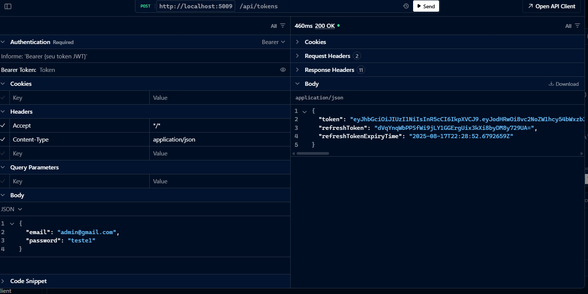
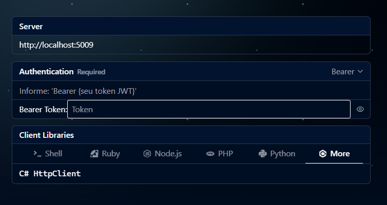

# 🖥️ Sistema de Reserva de Salas - Frontend

Este é o **backend** do sistema de reservas de salas de reunião, desenvolvido como parte de um teste técnico para a empresa **Banana Ltda**.  
O projeto foi construído com **ASP.NET Core**, **Entity Framework Core** e **SQLite**, com foco em **desempenho**, **segurança** e **validação robusta de dados**.

---

## 🚀 Tecnologias Utilizadas e Justificativa

- **ASP.NET Core 9.0.304**  
  Plataforma principal para desenvolvimento web, API RESTful e backend.

- **Entity Framework Core 9.0.8**  
  ORM para acesso a banco de dados SQLite.

- **SQLite**  
  Banco de dados leve e embutido utilizado para armazenar as informações da aplicação.

- **Authentication & Authorization**  
  - `Microsoft.AspNetCore.Authentication.JwtBearer` para autenticação via JWT.  
  - `Microsoft.AspNetCore.Identity.EntityFrameworkCore` para gerenciamento de usuários e roles.

- **MediatR 11.1.0**  
  Implementação do padrão CQRS para organização das operações da aplicação.

- **Mapster 7.4.0**  
  Para mapeamento entre entidades e DTOs, facilitando a transformação de dados.

- **FluentValidation 12.0.0**  
  Validação declarativa e fluente das entradas recebidas via API.

- **Ardalis.Result 10.1.0**  
  Tratamento padronizado de resultados e erros nas operações do backend.

- **Serilog** (com vários enriquecedores e sinks)  
  Log estruturado e eficiente, com suporte para gravação em SQLite, debug e logging assíncrono.

- **Bogus 35.6.3**  
  Biblioteca para geração de dados falsos em testes e desenvolvimento.

- **OpenAPI / Scalar**  
  Documentação automática da API para facilitar testes e integração.

---

## 📋 Requisitos

- .NET SDK 9.0.304 instalado (download em [https://dotnet.microsoft.com/en-us/download/dotnet/9.0](https://dotnet.microsoft.com/en-us/download/dotnet/9.0))  
- Banco SQLite (não necessita instalação extra, arquivo gerado automaticamente)  
- Visual Studio 2022 ou superior, VS Code ou outra IDE compatível  
- Acesso à internet para restaurar os pacotes NuGet

---

## 📦 Como Baixar o Projeto

1. **Abrir o terminal**  
   - No **Windows**: pressione `Win + R`, digite `cmd` e pressione Enter.  
   - No **Mac/Linux**: abra o aplicativo **Terminal**.

2. **Clonar o repositório** (necessário ter o Git instalado)  
```bash
git clone https://github.com/seu-usuario/banana-frontend.git
cd banana-frontend
```

3. **Restaure os pacotes NuGet:**

```bash
dotnet build
```

4. **Executar o projeto e rodar migrações no banco de dados:**
```bash
cd src/Server
dotnet run
```


5. **Acesse a API via navegador ou Postman na URL padrão:**

```bash
http://localhost:5009/api-docs
```

---


## 📂 Estrutura do Projeto

- **Server**: Controladores REST para operações CRUD de reservas.  
- **Domain**: Entidades, agregados e lógica de negócio central.  
- **Application**: Serviços, comandos, consultas, handlers e validações.  
- **Infrastructure**: Configuração do Entity Framework, autenticação, logs e banco de dados.  


---

## 📌 Scalar com o Token de Autenticação

- Abrir o Scalar
Inicie o cliente Scalar para fazer as requisições à API.

- Obtenha o Token JWT
Após autenticar-se no sistema no endpoint **/api/tokens**, você receberá um token JWT. Esse token será usado para autenticar todas as requisições subsequentes.



Use as credenciais:

```json
{
  "email": "admin@gmail.com",
  "password": "teste1"
}
```

- Inserir o Token no Scalar
Na interface do Scalar, localize o campo de cabeçalho (headers) para adicionar tokens de autenticação.



- Use o valor:
Bearer <seu_token_jwt_aqui>
Faça requisções com o token corretamente inserido no cabeçalho, faça as requisições para os endpoints protegidos da API. O token garante que você tenha permissão para acessar os recursos.

---

## 📄 Licença

Este projeto foi desenvolvido exclusivamente para fins de **avaliação técnica**.